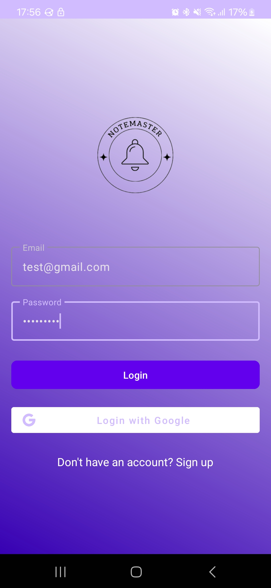

# OPSC7312
## Requirements
- Android Studio
- Gradle
- Android SDK 34

# Screenshot of App Running

## About

Welcome to the NoteMaster app walkthrough! In this app, managing your notes is simple and intuitive. From the Home screen, you can easily view all your notes in a clean and organized list. If you want to add a new note, just tap the 'New Note' button, which takes you to a screen where you can enter your note title and content. You can also edit or delete any existing notes by selecting them from the list—an edit button lets you make changes, while a delete button prompts a confirmation to ensure you don’t lose important information by accident. One of the standout features is the Unsplash Image Search, allowing you to add a visual touch to your notes. Simply type a keyword in the search bar, and you’ll be presented with beautiful, high-quality images from Unsplash, which you can easily add to your notes to create mood boards or visual journals.

From the top-left corner, the navigation menu provides quick access to different parts of the app. The 'Settings' section lets you update your profile picture by uploading an image, toggle dark mode to give the app a different look, and manage notifications, making the app feel more personalized. If you ever need to log out, you can easily do so from the menu as well, ensuring your account stays secure. Whether you’re using NoteMaster to stay organized, plan your tasks, or get inspired with images, this app provides an easy-to-use and visually appealing experience.
